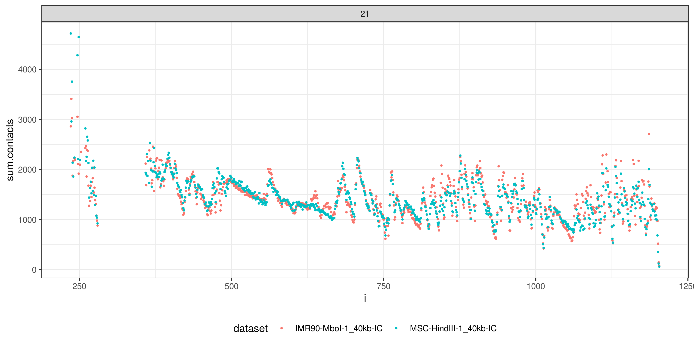

<style>
  body {
    text-align: justify
  }
</style>

```{r setup, include = FALSE}
knitr::opts_chunk$set(
  collapse = TRUE,
  warning = FALSE,
  comment = "#>"
)
```

DIADEM is R package for differential analysis of Hi-C data. It takes advantage of significant linear correlations of main diagonals between different Hi-C data sets (cell lines, experiments, etc.) - usually the first 100 diagonals from the main diagonal are considered. DIADEM uses GLM to model these dependancies and then quantifies deviations from the model in a probabilistic way.

This vignette contains the description of our method:

- basic introduction to Hi-C data and its related biases,
- issues with Hi-C differential analysis,
- normalization avoiding modelling of Hi-C data via GLM dependency modelling,
- detection of differential significantly interacting regions.

If you want to spare yourself extra reading and jump straight to analysis part, please see the quick start chapter. It contains a step-by-step introduction to Hi-C differential analysis with our package using an example Hi-C data set.

# Quick Start

Load the package:
```{r, eval=TRUE, echo=TRUE}
library("DIADEM")
library("magrittr")
library("ggplot2")
library("reshape2")


data(sample_hic_data, package = "DIADEM")

# save sample Hi-C matrices in sparse format to npz temporary files for demonstration purposes
# 1. create temporary file names
mtx.fname.imr90 <- file.path(tempdir(), "IMR90-MboI-1_40kb-raw.npz")
mtx.fname.msc <- file.path(tempdir(), "MSC-HindIII-1_40kb-raw.npz")

# 2. save matrices into npz files
chr.sizes <- sample_hic_data[["chromosome.sizes"]]

# IMR90 data
dat1 <- sample_hic_data[["IMR90-MboI-1"]]
l1 <- lapply(names(dat1), function(chromosome) sparse2dense(dat1[[chromosome]],
                                                            N = chr.sizes[[chromosome]]))
names(l1) <- names(dat1)
save_npz(l1, mtx.fname.imr90)

# MSC data
dat2 <- sample_hic_data[["MSC-HindIII-1"]]
l2 <- lapply(names(dat2), function(chromosome) sparse2dense(dat2[[chromosome]],
                                                            N = chr.sizes[[chromosome]]))
names(l2) <- names(dat2)
save_npz(l2, mtx.fname.msc)
```
```{r, eval=TRUE, echo=FALSE}
# check if HiCcomparator and HiCglm objects are saved in sample data object
if("HiCcomparator" %in% names(sample_hic_data)){
  hic.comparator <- sample_hic_data[["HiCcomparator"]]
}else{
  hic.comparator <- HiCcomparator(mtx.fname.imr90, mtx.fname.msc,
                                  mtx.names = c("21"), do.pca = TRUE)
}
if("HiCcomparator" %in% names(sample_hic_data)){
  hic.glm <- sample_hic_data[["HiCglm"]]
}else{
  hic.glm <- HiCglm(hic.comparator, diag.frac = 0.28,
                    ncores = ifelse(0 < (ncr <- detectCores() - 1), ncr, 1))
}
```


To compare Hi-C experiments, you will need 2 files with Hi-C matrices. In this tutorial, we will use Hi-C data sets of human IMR90 and human MSC cells lines from GSE63525 and GSE52457 studies respectively available as sample data in DIADEM package. For simplicity we will only use chromosome 18. First, we read the data:
```{r, eval=FALSE, echo=TRUE}
hic.comparator <- HiCcomparator(mtx.fname.imr90, mtx.fname.msc, mtx.names = c("21"), do.pca = TRUE)
```

## Contact maps and A/B compartments
Illustrate Hi-C contact maps with A/B compartments (feel free to adjust margins as you want):
```{r, eval=TRUE, echo=TRUE, out.width="100%", fig.cap="IMR90 and MSC contact maps with A/B compartments of human chromosome 21."}
dense.imr90 <- sparse2dense(hic.comparator$maps1[["21"]][c("i","j","val")],
                            N = hic.comparator$maps.dims[["21"]][1,"n.rows"])
dense.msc <- sparse2dense(hic.comparator$maps2[["21"]][c("i","j","val")],
                          N = hic.comparator$maps.dims[["21"]][2,"n.rows"])

par(mfrow = c(2,2), mai = rep(0.4, 4))

plot_contact_map(dense.imr90)
plot_contact_map(dense.msc)
plot_pc_vector(hic.comparator$pc1.maps1[["21"]])
plot_pc_vector(hic.comparator$pc1.maps2[["21"]])
```

## Contact maps and TADs
Determine TADs for both Hi-C maps and illustrate them:
```{r, eval=TRUE, echo=TRUE, out.width="100%", fig.cap=c("IMR90 contact maps of human chromosome 21 with TADs.","MSC contact maps of human chromosome 21 with TADs.")}
tads.imr90 <- map2tads(dense.imr90, resolution = 40*1000, window.bp = 400*1000, delta.bp = 80*1000)
tads.msc <- map2tads(dense.msc, resolution = 40*1000, window.bp = 400*1000, delta.bp = 80*1000)

par(mfrow = c(2,1), mai = c(1,1,1,1))
plot_with_inset(list(dense.imr90), c(600,1000), c(600,1000), args.regions = list(tads.imr90),
                mar = c(2,2,2,2))
plot_with_inset(list(dense.msc), c(600,1000), c(600,1000), args.regions = list(tads.msc),
                mar = c(2,2,2,2))
```

## Coverage and decays
Compare coverage and decays for IMR90 and MSC, for decays use log10 scales for both X and Y axis:
```{r, eval=TRUE, echo=TRUE, out.width="100%", fig.cap=c("Coverage comparison between IMR90 and MSC Hi-C data of human chromosome 21.","Decay comparison between IMR90 and MSC Hi-C data of human chromosome 21.")}
coverage <- dominating_signal(hic.comparator, which.signal = "coverage")

ggplot(coverage, aes(x = i, y = sum.contacts, color = dataset)) +
  geom_point(size = 0.5) +
  geom_smooth(alpha = 0.5) +
  facet_wrap(~ name, ncol = 1, scales = "free") +
  theme_bw() +
  theme(legend.position = "bottom")

decay <- dominating_signal(hic.comparator, which.signal = "decay")

ggplot(decay[decay$diagonal != 0,], aes(x = diagonal, y = mean.contacts, color = dataset)) +
  geom_point(size = 0.5) +
  scale_x_log10() +
  scale_y_log10() +
  facet_wrap(~ name, ncol = 1, scales = "free") +
  theme_bw() +
  theme(legend.position = "bottom")
```

## Fold Change and Differential maps
First, calculate the fold change and differential maps IMR90 / MSC and IMR90 - MSC respectively. Then, illustrate results with zoomin of 600 - 900 bins region. By default, when plotting fold change maps log10 scale is used. When plotting the differential map, one should indicate square root transformation of data for better visibility (see examples below):
```{r, eval=TRUE, echo=TRUE, out.width="100%", fig.cap=c("Fold Change map of IMR90 / MSC of human chromosome 21.","Differential map of IMR90 - MSC of human chromosome 21.")}
merged <- merge(hic.comparator)
merged.21 <- merged[["21"]]

merged.21$fc <- merged.21$val.x / merged.21$val.y
merged.21$difference <- merged.21$val.x - merged.21$val.y

dense.fc <- sparse2dense(merged.21[c("i","j","fc")], N = hic.comparator$maps.dims[["18"]][1,"n.rows"])
dense.diff <- sparse2dense(merged.21[c("i","j","difference")],
                           N = hic.comparator$maps.dims[["21"]][1,"n.rows"])

par(mfrow = c(2,1), mai = c(1,1,1,1))
plot_with_inset(list(dense.fc, fc = TRUE, colors.pal = c("blue","white","red")),
                c(600,1000), c(600,1000), which.map = "contact.map", mar = c(2,2,2,2))
plot_with_inset(list(dense.diff, breaks = 100, sqrt.transform = TRUE),
                c(600,1000), c(600,1000), which.map = "diff.map", mar = c(2,2,2,2))
```

## Diagonal correlations
Check the correlations between corresponding diagonals of IMR90 and MSC:
```{r, eval=TRUE, echo=TRUE, out.width="100%", fig.cap="Correlations (top) and their respective significances (bottom) between diagonals of IMR90 and MSC Hi-C data of human chromosome 21."}
decay.cor <- decay_correlation(hic.comparator, pooled = FALSE)
dc <- decay.cor[decay.cor$name == "21",]
dc <- dc[dc$diagonal > 0,]

dc <- rbind(
  dc[c("diagonal", "pcc", "rho")] %>%
    set_colnames(c("diagonal", "Pearson", "Spearman")) %>%
    melt(id.vars = "diagonal", variable.name = "correlation", value.name = "value") %>%
    inset("what", value = "coefficient"),
  dc[c("diagonal", "pearson.pval", "spearman.pval")] %>%
    set_colnames(c("diagonal", "Pearson", "Spearman")) %>%
    melt(id.vars = "diagonal", variable.name = "correlation", value.name = "value") %>%
    inset("value", value = -log10(use_series(., "value"))) %>%
    inset("what", value = "significance")
)

ggplot(dc, aes(x = diagonal, y = value, color = correlation)) +
  geom_point(size = 0.4) +
  facet_wrap(~ what, ncol = 1, scales = "free_y") +
  geom_hline(data = data.frame(yint = -log10(0.01), what = "significance"),
             aes(yintercept = yint), linetype = "dashed") +
  theme_bw() +
  theme(legend.position = "bottom")
```

The same can be done for pooled diagonals (if pooling option were on - default when constructing HiCcomparator object):
```{r, eval=TRUE, echo=TRUE, out.width="100%", fig.cap="Correlations (top) and their respective significances (bottom) between diagonal pools of IMR90 and MSC Hi-C data of human chromosome 21."}
decay.cor <- decay_correlation(hic.comparator)
dcp <- decay.cor[decay.cor$name == "21",]
dcp <- dcp[dcp$diagonal > 0,]
colnames(dcp)[1] <- "dpool"

dp <- hic.comparator$diags.pool[["21"]]
dp.labels <- split(dp, dp$dpool) %>% sapply(function(df){
  if(nrow(df) == 1)
    as.character(df$diagonal)
  else
    paste0(min(df$diagonal), " - ", max(df$diagonal))
})

dcp <- base::merge(data.frame(dpool = names(dp.labels), drange = dp.labels, stringsAsFactors = FALSE),
                   dcp, by = "dpool")
dcp$drange <- factor(dcp$drange, levels = dp.labels)
lvs <- levels(dcp$drange)

dcp <- rbind(
  dcp[c("drange", "pcc", "rho")] %>%
    set_colnames(c("drange", "Pearson", "Spearman")) %>%
    melt(id.vars = "drange", variable.name = "correlation", value.name = "value") %>%
    inset("what", value = "coefficient"),
  dcp[c("drange", "pearson.pval", "spearman.pval")] %>%
    set_colnames(c("drange", "Pearson", "Spearman")) %>%
    melt(id.vars = "drange", variable.name = "correlation", value.name = "value") %>%
    inset("value", value = -log10(use_series(., "value"))) %>%
    inset("what", value = "significance")
)

ggplot(dcp, aes(x = drange, y = value, color = correlation)) +
  geom_point(size = 0.4) +
  xlab("diagonal range (diagonal pool)") +
  facet_wrap(~ what, ncol = 1, scales = "free_y") +
  geom_hline(data = data.frame(yint = -log10(0.01), what = "significance"),
             aes(yintercept = yint), linetype = "dashed") +
  theme_bw() +
  scale_x_discrete(breaks = lvs[seq(1, length(lvs), 2)]) +
  theme(legend.position = "bottom",
        axis.text.x = element_text(angle = 45, hjust = 1, size = 6))
```

## GLM modelling of chromatin interactions dependancy
Construct Hi-C glm models:
```{r, eval=FALSE, echo=TRUE}
hic.glm <- HiCglm(hic.comparator, diag.frac = 0.28,
                    ncores = ifelse(0 < (ncr <- detectCores() - 1), ncr, 1))
```

### Background model
Plot expected vs observed plot of E[Y = MSC | X = IMR90]:
```{r, eval=TRUE, echo=TRUE, out.width="100%", fig.cap="Expected vs observed interaction dependency (Y = MSC | X = IMR90) and. Each facet illustrates separate diagonal pool."}
chr <- "21"
set.seed(5)

dpools <- as.character(c(25, 28, 30))

lapply(dpools, function(dpool){
  dat <- hic.glm$model[[chr]][[dpool]]$data[c("val.x","val.y","diagonal")]
  dat.sim.1 <- simulate_contacts(hic.glm$model[[chr]][[dpool]]$data$val.x,
                                 hic.glm$model[[chr]][[dpool]]$model["Y | X",])
  dat.sim.2 <- simulate_contacts(hic.glm$model[[chr]][[dpool]]$data$val.y,
                                 hic.glm$model[[chr]][[dpool]]$model["X | Y",])
  label <- ifelse((mn <- min(dat$diagonal)) == (mx <- max(dat$diagonal)),
                  as.character(mn), paste0(mn, " - ", mx))
  dat <- dat[c("val.x","val.y")] %>%
      inset("diagonal.range", value = label) %>%
      inset("data.type", value = "observed")
  rbind(
    set_colnames(dat.sim.1, c("val.x","val.y")) %>%
      inset("diagonal.range", value = label) %>%
      inset("data.type", value = "expected") %>%
      inset("model", value = "Y | X"),
    set_colnames(dat.sim.2[2:1], c("val.x","val.y")) %>%
      inset("diagonal.range", value = label) %>%
      inset("data.type", value = "expected") %>%
      inset("model", value = "X | Y"),
    inset(dat, "model", value = "Y | X"),
    inset(dat, "model", value = "X | Y")
  )
}) %>% do.call("rbind",.) -> dd

ggplot(dd, aes(x = val.x, y = val.y, color = data.type)) +
  geom_point(size = 0.5, alpha = 0.8) +
  facet_grid(diagonal.range ~ model, scales = "free") +
  theme_bw() +
  theme(legend.position = "bottom")
```

### Differential (significance) matrix
When the background model is constructed differential map can be computed (and visualised):
```{r, eval=TRUE, echo=TRUE, out.width = '100%', fig.cap="Differential/Significance map of human chromosome 21 IMR90 vs MSC cell lines."}
diffmap <- hicdiff(hic.glm)
diffmap.dense <- hicdiff2mtx(diffmap, hic.glm$maps.dims)

# plot diffmap
col.pal <- c("darkblue", "blue", "steelblue", "green", "yellow", "orange", "red")
diffmap.dense.21 <- diffmap.dense[["21"]]
plot_with_inset(list(diffmap.dense.21, breaks = 100, colors.pal = col.pal),
                c(600,1000), c(600,1000), mar = c(2,2,2,2))
```

### Detection of Long Range Differentially Interacting regions
Finally groups of cells with significant depletion/enrichment can be identified (with some precision) as rectangle-like regions containing connected components:
```{r LRDI, eval=TRUE, echo=TRUE, out.width="100%", fig.cap=c("Detection of differential long range interactions in IMR90 vs MSC map. Significances threshold in E[Y = MSC | X = IMR90] is determined using bilinear model.", "The same as in previous figure, but now the models is E[X = IMR90 | Y = MSC].", "Differential/Significance map of human chromosome 21, IMR90 vs MSC cell lines with long range differentially interacting regions.", "The same figure, but with zoomin.")}
lrdi <- differential_interactions(hic.glm, sig.map = diffmap)

# get rectangle like regions
regions <- lrdi[["21"]]$interacting.regions

# plot them --> only those which contain at least 10 cells inside connected component
plot_contact_map(diffmap.dense.21, breaks = 100, colors.pal = col.pal)
plot_regions(regions[regions$n.cells >= 10, 2:5], lwd = 1, pal.colors = "magenta")
# plot again - with inset
plot_with_inset(list(diffmap.dense.21, breaks = 100, colors.pal = col.pal),
                c(600,1000), c(600,1000), mar = c(2,2,2,2),
                args.regions = list(regions[regions$n.cells >= 10, 2:5], lwd = 1, pal.colors = "magenta"))
```

# About the Hi-C protocol

Hi-C is the high-resolution variant of the 3C (Chromosome Conformation Capture) technique, which samples chromatin interactions genome-wide [@lieberman2009comprehensive]. The result of the Hi-C experiment is a library of paired-end reads indicating pairs of chromatin regions that were in close 3D proximity in initial sample (i.e. interacting regions). This library is then mapped to reference genome to locate interacting regions and interactions are counted and summarized in the form of non negative matrices called contact maps. To construct the contact map, one must first specify the resolution parameter a number of basepairs per unit (typically between mega- and kilo-basepairs). Correct selection of the resolution parameter was studied in the literature and there are some guidelines as to how to approach this problem [@lajoie2015hitchhiker; @yang2017hicrep]. A contact map cell with coordinates i,j contains a number of interactions between genomic regions i and j inside the sample captured in the experiment. An important note here is that in most cases the Hi-C protocol is performed on a sample containing billions of cells (rather than a single, isolated cell) and therefore the resulting contact maps contain sums of interactions over possibly distinct cell populations. There are 2 types of contact maps: inter- and intrachromosome. Usually due to the effect called chromosome territories leading to very low contact counts between chromosomes of interest are only intrachromsome matrices.
```{r, eval=TRUE, echo=FALSE, fig.cap="Contact map of human chromosome 21 IMR90 cell line in 40kb resolution.", out.width = '100%'}
plot_with_inset(list(dense.imr90), c(600,1000), c(600,1000), mar = c(2,2,2,2))
```

Hi-C is a complex protocol with many sources of bias [@yaffe2011probabilistic]. This makes the analysis of this type of data very challenging. Therefore, any biological study utilizing Hi-C data performed without taking these biases into account will lead to severely biased results.

Here we consider a problem of comparing 2 Hi-C datasets. Depending on experimental design it may be, for example, different cell lines or different experimental conditions. This sort of studies apper frequently in literature making the problem of countering biases important [@le2014distinct; @dixon2015chromatin; @lun2015diffhic]. We present key issues arising in this type of assays and suggest a model, which have potential to improve the reliability of Hi-C differential analysis.

# Hi-C differential analysis

The Hi-C differential analysis aims to discover and quantify regions that are significantly depleted or enriched in interactions between 2 contact maps of interest. First thing we should note is that when we compare two raw Hi-C datasets, both the read coverage and distance dependant contact decay will be significantly more diverse between samples then the actual cell-specific differences. This makes the direct comparisons of contact maps only suitable on raw data if one is interested in these global trends.
```{r, eval=TRUE, echo=FALSE, fig.cap="Coverages (sum of contacts per region) of human chromosome 21 from 2 Hi-C experiments: IMR90 and MSC cell lines.", out.width = '100%'}
ggplot(coverage, aes(x = i, y = sum.contacts, color = dataset)) +
  geom_point(size = 0.5) +
  facet_wrap(~ name, ncol = 1, scales = "free") +
  theme_bw() +
  theme(legend.position = "bottom")
```
```{r, eval=TRUE, echo=FALSE, fig.cap="Decays (mean of contacts per diagonal) of human chromosome 21 from 2 Hi-C experiments: IMR90 and MSC cell lines.", out.width = '100%'}
ggplot(decay[decay$diagonal != 0,], aes(x = diagonal, y = mean.contacts, color = dataset)) +
  geom_point(size = 0.5) +
  scale_x_log10() +
  scale_y_log10() +
  facet_wrap(~ name, ncol = 1, scales = "free") +
  theme_bw() +
  theme(legend.position = "bottom")
```
As an example, we take the scenario where in the first Hi-C experiment sequencing depth is 3 times that of the second experiment. Obviously, the naive comparison will lead to the conclusion that almost any pair of regions is enriched in interactions in experiment 1 with respect to 2.
```{r, eval=TRUE, echo=FALSE, fig.cap="Fold Change map of IMR90 / MSC of human chromosome 21.", out.width = '100%'}
plot_with_inset(list(dense.fc, fc = TRUE, colors.pal = c("blue","white","red")),
                c(600,1000), c(600,1000), which.map = "contact.map", mar = c(2,2,2,2))
```
This leads to, now standard techniques that focus on normalizing the coverage across chromosomal length. One prime example of such normalization is the iterative correction method [@imakaev2012iterative] that assumes that the read coverage across the genome should be uniform. As we can see in fig. \@ref(fig:coverageIMR90vsMSCice) it is quite effective in reducing the difference in total coverage. 
```{r coverageIMR90vsMSCice, eval=TRUE, echo=FALSE, fig.cap="Coverage (sum of contacts per region) of human chromosome 21 from 2 Hi-C experiments: IMR90 and MSC cell lines after Iterative Correction.", out.width = '100%'}

```
However it does not seem to reduce the differences in distance dependant contact decay. As we can see in fig. \@ref(fig:decayIMR90vsMSCice) this bias is still strikingly different in the normalized data.
```{r decayIMR90vsMSCice, eval=TRUE, echo=FALSE, fig.cap="Decays (mean of contacts per diagonal) of human chromosome 21 from 2 Hi-C experiments: IMR90 and MSC cell lines after Iterative Correction.", out.width = '100%'}

```
```{r, eval=TRUE, echo=FALSE, fig.cap="Fold Change map of IMR90 / MSC of human chromosome 21 with both maps iteratively corrected.", out.width = '100%'}

```

What is worse, different normalization methods can lead to different biases in the decay rate. As we can see in fig. \@ref(fig:normalizationDecayIMR90vsMSCice) two well-known and widely used normalization methods HiCNorm [@hu2012hicnorm] and ICE yield opposite relationship between contact decays of IMR90 and MSC datasets.
```{r normalizationDecayIMR90vsMSCice, eval=TRUE, echo=FALSE, fig.cap="Comparison of contact decays (mean of contacts per diagonal) of human chromosomes 18 and 19 from 2 Hi-C experiments: IMR90 and MSC cell lines between HiCNorm and Iterative Correction normalization methods.", out.width = '100%'}

```
A possible workaround could be the normalization avoiding method, which tries to model similarities in coverage and contact decay between both Hi-C experiments simultaneously and then seeks for deviations from the model.

# Modelling dependency between Hi-C datasets

Our method is based on an observation that the pattern of interactions between corresponding diagonals of Hi-C maps is similar and statistically significant for pairs of regions located nearby as measured by linear chromosomal distance. As an example consider below images illustrating Pearson and Spearman correlation between pairs of consecutive diagonals from pair of contact maps. To calculate the correlations, only the cells containing interactions in both experiments (contact maps) are used.
```{r, eval=TRUE, echo=FALSE, fig.cap="Correlations between corresponding diagonals (i.e. 1 vs 1, 2 vs 2, etc) of IMR90 vs MSC Hi-C contact map of human chromosome 21. Top panel - coefficient, bottom panel - statistical significances.", out.width = '100%'}
ggplot(dc, aes(x = diagonal, y = value, color = correlation)) +
  geom_point(size = 0.4) +
  facet_wrap(~ what, ncol = 1, scales = "free_y") +
  geom_hline(data = data.frame(yint = -log10(0.01), what = "significance"),
             aes(yintercept = yint), linetype = "dashed") +
  theme_bw() +
  theme(legend.position = "bottom")
```
Although correlations between experiments originating from different cell lines are much lower than between biological replicates of single cell line they are still highly significant indicating of similarities of the interactions pattern. The trends shown above are representative of many other cell types and chromosomes analyzed by us.

After more thorough inspection of interaction patterns we hypothesized that the strength of interactions in contact map B dependes linearly on the strength of coresponding interaction (i.e. with the same coordinates) in contact map A for most of Hi-C contacts up to some distance between interacting regions. There is however a little fraction of interacting regions, which exhibit large deviation from linearity and are potential differential contacts. Based on this observation we assume that most of chromatin interactions is preserved even between different Hi-C datasets and their similarity can be modelled using linear model thus comprising null model. Due to apparent heteroscedasticity in observed dependency we choose to model similarity pattern using robust Negative Binomial regression [@aeberhard2014robust]. Our algorithm can be summarized in following steps:

1. pool diagonals based on paired (A,B) interactions distributional similarity,
2. fit NB regression using robust estimation procedure (figure \@ref(fig:modelSummary)b),
3. calculate significance of each point given the model (figure \@ref(fig:modelSummary)c),
4. adjust pvalues using Benjamini-Hochberg method (figure \@ref(fig:modelSummary)d).

Alternatively instead of robust estimation one may choose another procedure, which uses SMDM-estimator to obtain linear model coefficients and associated residual weights [@koller2011sharpening] - figure \@ref(fig:modelSummary)a. This weights are then used to determine outliers and remove them. Afterwards NB regression is fitted using ordinary MLE. More details may be found in manuscript. Our package uses robust NB regression model implemented in https://github.com/williamaeberhard/glmrob.nb and robust linear regression implemented in package [robustbase](https://cran.r-project.org/web/packages/robustbase/index.html) (method = "KS2014").
```{r modelSummary, eval=TRUE, echo=FALSE, fig.cap="Model selection and p-value calculation.", out.width = '100%'}

```
As can be seen on the figure below our model detects interactions that form large clusters of significant neighboring cells, which seems to indicate nonrandom effect.
```{r, eval=TRUE, echo=FALSE, out.width = '100%', fig.cap="Differential/Significance map of human chromosome 21 IMR90 vs MSC cell lines."}
plot_with_inset(list(diffmap.dense.21, breaks = 100, colors.pal = col.pal),
                c(600,1000), c(600,1000), mar = c(2,2,2,2))
```

# Detection of differential significantly interacting regions

Given differential (significance) map often of interest are groups of enriched cells, which are close neighbors (in terms of euclidean distance in i, j, p-value space) for some p-value cutoff. To find such aggregates of cells we designed a simple algorithm based on connected components search. Below panel with pseudocode explains main steps of this procedure. Briefly, the algorithm first selects non zero cells from significance matrix, sorts them and fits a bilinear model. An intersection point between linear functions derived from the model indicate threshold (red vertical line), which divides cells on significant and non significant differentially interacting regions. Additionally p-value threshold (grey vertical line) is fixed (by default to 0.01 and can be changed) to prohibit the selection of non significant cells in cases when the bilinear model assumption is violated (see figures \@ref(fig:LRDI1) and \@ref(fig:LRDI2) - top and middle as an example).

In the last step a zero matrix with the same shape as initial significance matrix is constructed. Cell coordinates corresponding to that of significant ones are marked with 1. Resulting binary matrix is scanned for connected components. To perform a connected components search, the [clump](https://www.rdocumentation.org/packages/raster/versions/2.8-4/topics/clump) function from the [raster](https://cran.r-project.org/web/packages/raster/index.html) package is used [@rasterPackage]. Briefly the algorithm works by iterating through list of vertices and invoking Depth First Search procedure for every unvisited vertex until all vertices are marked as visited. The algorithm outputs 2 elements:

*  a list with dataframes containing connected components (rows correspond to cells within the same component),
*  a dataframe with rectangle like regions enclosing connected components.

By providing such an output, we give the users flexibility to individually filter resulting regions by the size of connected components (i.e. number of significant cells within component). An example output illustrated on significance map is presented below for 2 thresholds: components with at least 10 significant cells and components containing at least 20 significant cells.
```{r, eval=TRUE, echo=FALSE, fig.cap="Long range differential interactions with connected components containing at least 5 significant cells.", out.width = '100%'}
#knitr::include_graphics("images/significant-differential-LRI-IMR90-MSC-chr18-atLeast10.png")
plot_contact_map(diffmap.dense.21, breaks = 100, colors.pal = col.pal,
                 xlim = c(400, 700), ylim = c(400, 700))
plot_regions(regions[regions$n.cells >= 5, 2:5], lwd = 1, pal.colors = "magenta")
```
```{r, eval=TRUE, echo=FALSE, fig.cap="Long range differential interactions with connected components containing at least 10 significant cells.", out.width = '100%'}
#knitr::include_graphics("images/significant-differential-LRI-IMR90-MSC-chr18-atLeast20.png")
plot_contact_map(diffmap.dense.21, breaks = 100, colors.pal = col.pal,
                 xlim = c(400, 700), ylim = c(400, 700))
plot_regions(regions[regions$n.cells >= 10, 2:5], lwd = 1, pal.colors = "magenta")
```

Session info:
```{r}
sessionInfo()
```

# References {-}
